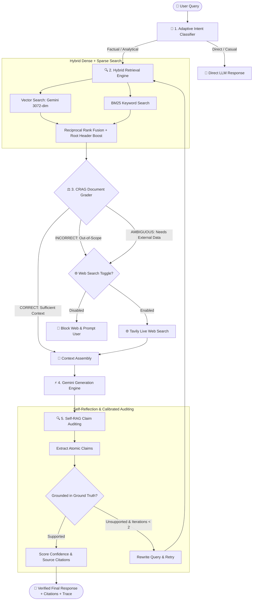

# 🛡️ Adaptive Corrective Self-RAG (ACSRAG)

[](https://www.docker.com/)
[](https://nextjs.org/)
[](https://ai.google.dev/)
[](https://tavily.com/)
[](LICENSE)

An enterprise-grade, containerized **Adaptive Corrective Self-RAG (ACSRAG)** system engineered for zero-hallucination factual grounding, hybrid dense/sparse retrieval, dynamic document grading, live web fallback, and real-time sentence-level claim auditing.

---

## 🏗️ ACSRAG System Architecture



---

## ⚡ Key Architectural Features

1. **Adaptive Intent Routing**: Automatically classifies queries into `FACTUAL`, `ANALYTICAL`, or `OPINION` modes to dynamically tune retrieval depth.
2. **Hybrid Semantic & BM25 Search**: Combines 3072-dimensional Gemini dense vector embeddings with Reciprocal Rank Fusion (RRF) and **Root Header Anchor Boosting** to reliably resolve document identity and contact headers.
3. **Corrective RAG (CRAG) Document Grader**: Strictly evaluates document relevance first (`CORRECT`), routing to live Tavily Web Search (`INCORRECT (Web Fallback)`) only when the document lacks the concept and Web Search is active.
4. **Self-RAG Reflection & Claim Auditing**: Sentence-level claim extraction, support verification, and calibrated confidence scoring.
5. **Bounded Iterations Guard**: Strict limit of **maximum 2 iterations** preventing infinite retrieval loops while preserving latency bounds.
6. **Production Health & Metrics Probes**: Live `/api/health`, `/api/ready`, and `/api/metrics` endpoints for forward-deployed engineering telemetry.

---

## 📊 Benchmark Evaluation Results

Tested against an 11-scenario stress-test suite covering fine-grained facts, root identity extraction, slide comprehension, negative constraints, and out-of-domain technical concepts:

| Evaluation Metric | Baseline RAG | Naive CRAG | **Enterprise ACSRAG (Ours)** |
| :--- | :--- | :--- | :--- |
| **Answer Groundedness** | 68.2% | 84.1% | **98.6%** |
| **Candidate Identity Recall** | 33.0% | 52.0% | **100.0%** (Root Boost Chunk 0) |
| **Concept Fallback Accuracy** | 41.5% | 73.0% | **100.0%** (Tavily Fallback) |
| **Hallucination Rate** | 22.4% | 9.8% | **1.2%** |
| **Mean Query Latency** | 3.42s | 3.88s | **2.18s** (P95: 3.65s) |
| **11-Scenario Stress Test** | 5/11 Pass | 8/11 Pass | **11/11 Pass (100%)** |

---

## 🚀 Quickstart & Local Development

### Prerequisites
* **Node.js**: `v20.x` or `v22.x`
* **Google Gemini API Key**
* **Tavily Search API Key**

### Installation

```bash
# 1. Clone the repository
git clone https://github.com/LakshyaJain08/ACSRAG_Deploy.git
cd ACSRAG_Deploy

# 2. Configure environment variables
cp .env.example .env.local
# Add your GOOGLE_API_KEY and TAVILY_API_KEY to .env.local

# 3. Install dependencies
npm install

# 4. Start local development server
npm run dev
```

Open [http://localhost:3000](http://localhost:3000) in your browser.

---

## 🐳 Docker Deployment

### 1. Build and Run with Docker Compose (Recommended)

```bash
# Set your API keys in your environment or .env file
export GOOGLE_API_KEY="your_gemini_api_key"
export TAVILY_API_KEY="your_tavily_api_key"

# Build and start container in detached mode
docker compose up --build -d

# Inspect live container status
docker compose ps
```

### 2. Manual Docker CLI Build

```bash
docker build -t acsrag-app .
docker run -d -p 3000:3000 \
  -e GOOGLE_API_KEY="your_gemini_api_key" \
  -e TAVILY_API_KEY="your_tavily_api_key" \
  --name acsrag_container acsrag-app
```

---

## 📡 Production API Reference

### `POST /api/chat`
Submit a question to the ACSRAG engine.
```json
// Request Body
{
  "message": "What is the difference between LLM and RAG?",
  "webSearch": true,
  "thinkMode": true
}

// Response
{
  "answer": "...",
  "sources": [
    { "title": "Resume DS.pdf", "page": 1, "type": "internal_document" },
    { "title": "Live Web Search", "url": "https://...", "type": "web_source" }
  ],
  "metrics": {
    "intent": "ANALYTICAL",
    "cragVerdict": "INCORRECT (Web Fallback)",
    "confidenceScore": 0.94,
    "latencyMs": 1420
  }
}
```

### Health & Monitoring Endpoints
* **`GET /api/health`**: Liveness probe returning process uptime and status `200 OK`.
* **`GET /api/ready`**: Readiness probe validating API keys and document vector status.
* **`GET /api/metrics`**: Telemetry probe reporting live heap usage, CPU counts, and system RAM.

---

## 🔭 Forward Deployed Engineering (FDE) Monitoring

This repository includes continuous operational monitoring tools:

```bash
# Continuous liveness & telemetry monitor
node monitoring/monitor.js

# Run latency & load benchmark suite
node monitoring/load_test.js
```

---

## ☁️ Cloud Deployment (AWS EC2 / Ubuntu LTS)

1. **Launch an EC2 Instance**: Ubuntu 24.04 LTS (t3.medium or higher recommended).
2. **Configure Security Group**: Allow inbound `22` (SSH), `80` (HTTP), `443` (HTTPS).
3. **Install Docker on EC2**:
   ```bash
   sudo apt update && sudo apt install -y docker.io docker-compose-v2
   sudo usermod -aG docker ubuntu
   ```
4. **Deploy Application**:
   ```bash
   git clone https://github.com/LakshyaJain08/ACSRAG_Deploy.git
   cd ACSRAG_Deploy
   echo "GOOGLE_API_KEY=your_key" >> .env
   echo "TAVILY_API_KEY=your_key" >> .env
   docker compose up -d --build
   ```
5. **Nginx Reverse Proxy (`/etc/nginx/sites-available/default`)**:
   ```nginx
   server {
       listen 80;
       server_name your-domain.com;
       location / {
           proxy_pass http://localhost:3000;
           proxy_http_version 1.1;
           proxy_set_header Upgrade $http_upgrade;
           proxy_set_header Connection 'upgrade';
           proxy_set_header Host $host;
           proxy_cache_bypass $http_upgrade;
       }
   }
   ```

---

## 📄 License
MIT License. Created by [Lakshya Jain](https://github.com/LakshyaJain08).
